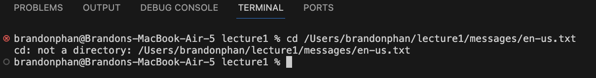
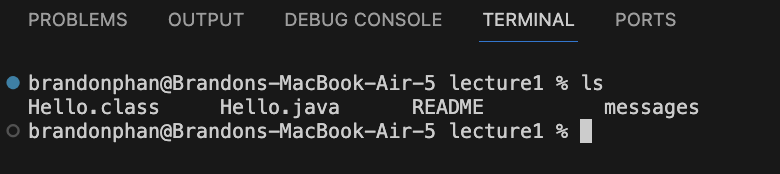
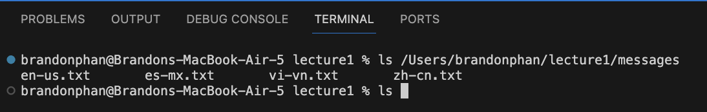
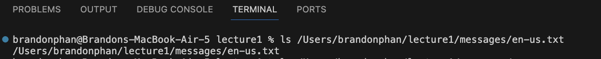
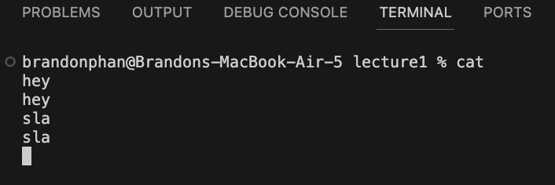
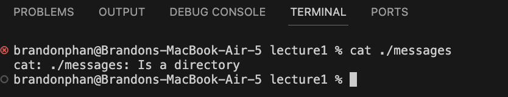

Brandon Phan, Lab 1 Report

## cd with no arguments

Absolute Path: `/Users/brandonphan/lecture1`

Explanation: I did not get an output, but it did change my working directory to the root directory, `/Users/brandonphan`. 
 I assume since I provided no arguments, it defaulted to sending me to the root directory.

Error or Not: The output is not an error. 

## cd with path to a directory

Absolute Path: `/Users/brandonphan/lecture1`

Explanation: I did not get an output, but it did change my working directory to `/Users/brandonphan/lecture1/messages`. This happened because this is the function of cd; it changes the working directory to the specified path.

Error or Not: The output is not an error. 

## cd with path to a file

Absolute Path: `/Users/brandonphan/lecture1`

Explanation: I got the "not a directory" error because cd is meant to change what your working directory is, and your working directory can not be a text file. 

Error or Not: This is an error. 

## ls with no arguments

Absolute Path: `/Users/brandonphan/lecture1`

Explanation: I got the contents of the lecture1 directory printed into the terminal since that is our working directory. 

Error or Not: This is not an error. 

## ls with path to a director

Absolute Path: `/Users/brandonphan/lecture1`

Explanation: I got the contents of the messages directory printed into the terminal since that was the directory specified. 

Error or Not: This is not an error. 

## ls with path to a file

Absolute Path: `/Users/brandonphan/lecture1`

Explanation: I got the path to the file returned to me in the output. 

Error or Not: This is an error, as ls prints out the contents of a directory, not a file. 

## cat with no arguments

Absolute Path: `/Users/brandonphan/lecture1`

Explanation: I am unable to enter any more commands. 

Error or Not: This is an error. Cat is supposed to print out the contents of a file, but no file was specified. 

## cat with path to a directory

Absolute Path: `/Users/brandonphan/lecture1`

Explanation: I got an error message that what I specified was a directory, not a file. 

Error or Not: This is an error. Cat is supposed to print out the contents of a file, but a directory was specified, not a file.

## cat with path to a file

Absolute Path: `/Users/brandonphan/lecture1`

Explanation: The command printed out the contents of the en-us.txt file. This is the function of the cat command; it prints out the contents of a file into the terminal. 

Error or Not: This is not an error. 
