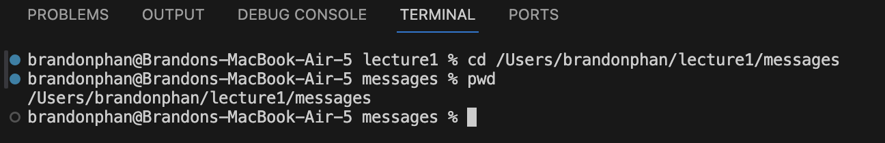

Brandon Phan, Lab 1 Report

## cd with no arguments

Absolute Path: /Users/brandonphan/lecture1

Explanation: I did not get an output, but it did change my working directory to the root directory, `/Users/brandonphan`. 
 I assume since I provided no arguments, it defaulted to sending me to the root directory.

Error or Not: The output is not an error. 

## cd with path to a directory

Absolute Path: /Users/brandonphan/lecture1

Explanation: 

Error or Not: The output is not an error. 

## cd with path to a file

[insert image here

Absolute Path: /Users/brandonphan/lecture1
