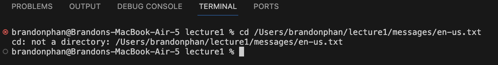

Brandon Phan, Lab 1 Report

## cd with no arguments

Absolute Path: `/Users/brandonphan/lecture1`

Explanation: I did not get an output, but it did change my working directory to the root directory, `/Users/brandonphan`. 
 I assume since I provided no arguments, it defaulted to sending me to the root directory.

Error or Not: The output is not an error. 

## cd with path to a directory

Absolute Path: `/Users/brandonphan/lecture1`

Explanation: I did not get an output, but it did change my working directory to `/Users/brandonphan/lecture1/messages`. This happened because this is the function of cd; it changes the working directory to the specified path.

Error or Not: The output is not an error. 

## cd with path to a file

Absolute Path: `/Users/brandonphan/lecture1`

Explanation: I got the "not a directory" error because cd is meant to change what your working directory is, and your working directory can not be a text file. 

Error or Not: This is an error. 
