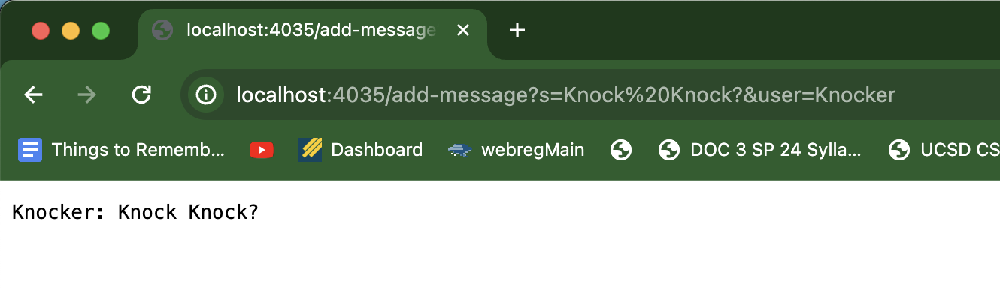

## Part 1, ChatServer


ChatServer code:
```
import java.io.IOException;
import java.net.URI;

class Handler3 implements URLHandler {
    // The one bit of state on the server: a number that will be manipulated by
    // various requests.
    String log = "";

    public String handleRequest(URI url) {
        if (url.getPath().equals("/")) {
            return log;
        } 
        else if (url.getPath().contains("/add-message")) {
            String[] parameters = url.getQuery().split("&");
            String[] message = parameters[0].split("=");
            String[] user = parameters[1].split("=");

            if (message[0].equals("s") && user[0].equals("user")) {
                log += user[1] + ": " + message[1] + "\n";

                return log;
            }
        }
        return "404 Not Found!";
    }
}

class ChatServer {
    public static void main(String[] args) throws IOException {
        if(args.length == 0){
            System.out.println("Missing port number! Try any number between 1024 to 49151");
            return;
        }

        int port = Integer.parseInt(args[0]);

        Server.start(port, new Handler3());
    }
}
```

Screenshots:

The method called in the `Handler3` class is the `handleRequest` method, and within that method, I call the `contains`, `getQuery`, `getPath`, `splits`, and `equals` methods. In the actual ChatServer class, I call the `Server.start` method and the `parseInt` method. 
The main relevant argument is the URI url, which in this case is `http://localhost:4035/add-message?s=Knock%20Knock?&user=Knocker`. This is passed into the handleRequest method. The main relevant field is the `log` field, which contains the message log. 
The log field changed from the **empty string** to `"Knocker: Knock Knock?\n" 


.

