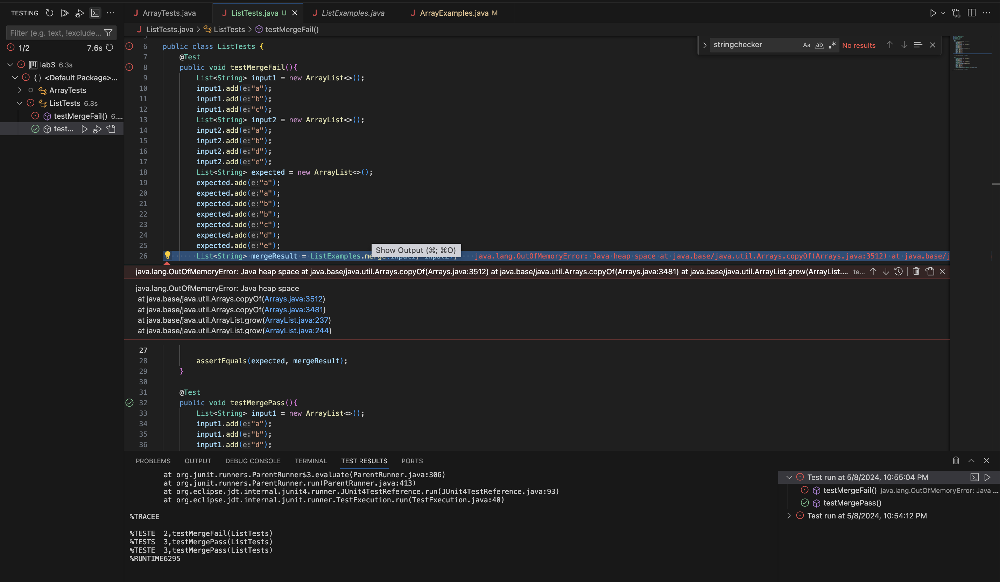

## Part 1 - Bugs

Failure-Inducing Test
```
@Test 
public void testMergeFail(){
        List<String> input1 = new ArrayList<>();
        input1.add("a");
        input1.add("b");
        input1.add("c");
        List<String> input2 = new ArrayList<>();
        input2.add("a");
        input2.add("b");
        input2.add("d");
        input2.add("e");
        List<String> expected = new ArrayList<>();
        expected.add("a");
        expected.add("a");
        expected.add("b");
        expected.add("b");
        expected.add("c");
        expected.add("d");
        expected.add("e");
        List<String> mergeResult = ListExamples.merge(input1, input2);

        assertEquals(expected, mergeResult);
}
```

Succesful Test
```
@Test 
public void testMergePass(){
	List<String> input1 = new ArrayList<>();
        input1.add("a");
        input1.add("b");
        input1.add("d");
        List<String> input2 = new ArrayList<>();
        input2.add("b");
        input2.add("c");
        List<String> expected = new ArrayList<>();
        expected.add("a");
        expected.add("b");
        expected.add("b");
        expected.add("c");
        expected.add("d");
        List<String> mergeResult = ListExamples.merge(input1, input2);

        assertEquals(expected, mergeResult);
}
```

Symptom Screenshot


Bugs

Before Code:
```
  static List<String> merge(List<String> list1, List<String> list2) {
    List<String> result = new ArrayList<>();
    int index1 = 0, index2 = 0;
    while(index1 < list1.size() && index2 < list2.size()) {
      if(list1.get(index1).compareTo(list2.get(index2)) < 0) {
        result.add(list1.get(index1));
        index1 += 1;
      }
      else {
        result.add(list2.get(index2));
        index2 += 1;
      }
    }
    while(index1 < list1.size()) {
      result.add(list1.get(index1));
      index1 += 1;
    }
    while(index2 < list2.size()) {
      result.add(list2.get(index2));
      index1 += 1;
    }
    return result;
  }
```

After Code:
```
  static List<String> merge(List<String> list1, List<String> list2) {
    List<String> result = new ArrayList<>();
    int index1 = 0, index2 = 0;
    while(index1 < list1.size() && index2 < list2.size()) {
      if(list1.get(index1).compareTo(list2.get(index2)) < 0) {
        result.add(list1.get(index1));
        index1 += 1;
      }
      else {
        result.add(list2.get(index2));
        index2 += 1;
      }
    }
    while(index1 < list1.size()) {
      result.add(list1.get(index1));
      index1 += 1;
    }
    while(index2 < list2.size()) {
      result.add(list2.get(index2));
      index2 += 1;
    }
    return result;
  }
```

Explanation

The bug with the original code was in the third while loop, which activates when the second given list isn't cycled through in the first while loop, it was incrementing index1 instead of index2. This led to an infinite loop. The fix is to change it to index2, which fixes the infinite loop. 


## Part 1 - Researching Commands
