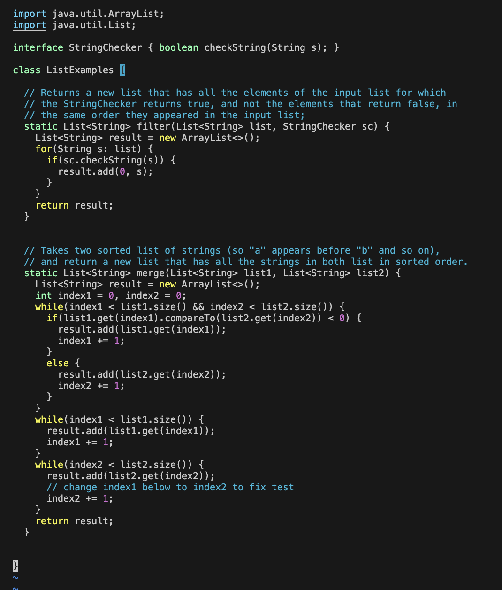
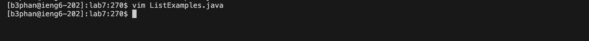

Setup Delete any existing forks of the repository you have on your account. See this Github link on how to delete forks.
Setup Fork the repository
The real deal Start the timer!
Log into ieng6
Clone your fork of the repository from your Github account (using the SSH URL)
Run the tests, demonstrating that they fail
Edit the code file to fix the failing test
Run the tests, demonstrating that they now succeed
Commit and push the resulting change to your Github account (you can pick any commit message!)

### Lab 4, VIM

Step 4: Log into ieng6

Keys Pressed: 

`ssh` `<space>` `b3phan@ieng6.ucsd.edu` `<enter>`

I typed out the command to log into ieng6, which was `ssh` `<space>` `b3phan@ieng6.ucsd.edu`. I then clicked enter to run the command.

---

Step 5: Clone your fork of the repository from your Github account (using the SSH URL)

Keys Pressed: 

`clear` `<enter>` 

`git` `<space>` `clone` `<space>` 

`<command>` `v` `<enter>`

I used the `clear` command to get a clear screenshot of the next command. I then wrote `git` `<space>` `clone` `<space>` as that is the command to clone a repository. I then did `<command>` + `v` in order to paste the link to the repository, which is `https://github.com/BrandonPhanUCSD/lab7` which I had copied from before Step 4.

---

Step 6: Run the tests, demonstrating that they fail

Keys Pressed: 

`clear` `<enter>` 

`cd` `<space>` `lab7` `<enter>` 

`ls` `<enter>`

`bash` `<space>` `test.sh` `<enter>`

I used the `clear` command to get a clear screenshot of the next command. I then changed my directory into the `lab7` directory by typing out `cd` `<space>` `lab7`. I then used the 'ls' command in order to find the name of the script I had to run since I forgot the name. I then ran that script by typing `bash` `<space>` `test.sh`, which ran the bash script `test.sh`.

---

Step 7: Edit the code file to fix the failing test

Keys Pressed:

`vim` `<space>` `ListExamples.java` `<enter>`

`40` `j` `j` `j` `12` `l` `h`

`r` `2` 

`<command> `<shift>` `4`

`<shift>` `:` `wq` `<enter>`

In order to edit the code, I used vim to fix ListExamples.java by running the command `vim` `<space>` `ListExamples.java`. I then navigated to the error by using the following commands: `40` `j` `j` `j` `12` `l` `h`. I then replaced index1 with index2 by using vim's replacement command: `r` `2`. I then took a screenshot for this lab by inputting `<command> `<shift>` `4`. Finally, I saved and quit the java file using `<shift>` `:` `wq` `<enter>`.
