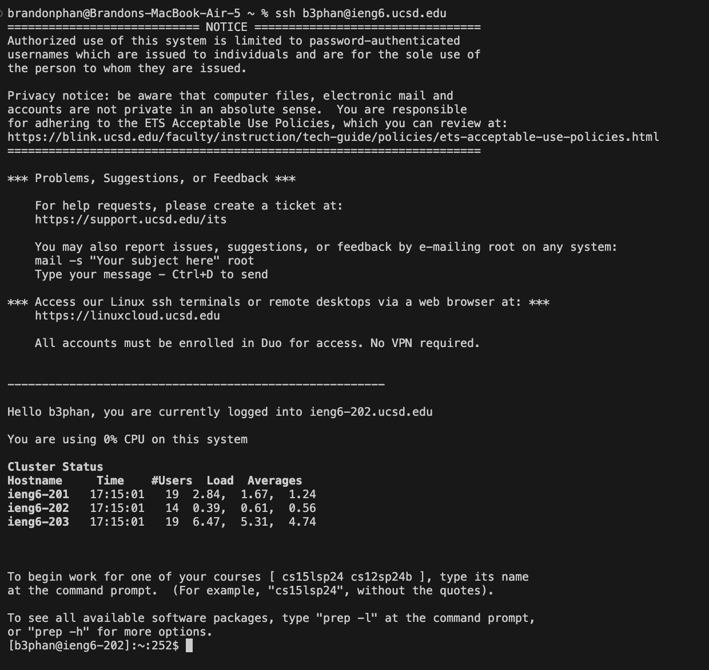
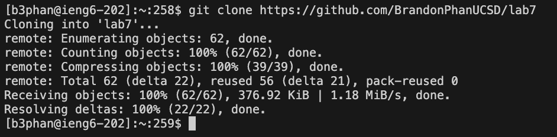
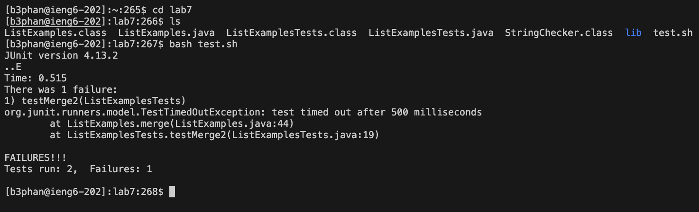

Setup Delete any existing forks of the repository you have on your account. See this Github link on how to delete forks.
Setup Fork the repository
The real deal Start the timer!
Log into ieng6
Clone your fork of the repository from your Github account (using the SSH URL)
Run the tests, demonstrating that they fail
Edit the code file to fix the failing test
Run the tests, demonstrating that they now succeed
Commit and push the resulting change to your Github account (you can pick any commit message!)

### Lab 4, VIM

Step 4: Log into ieng6

Keys Pressed: 

`ssh` `<space>` `b3phan@ieng6.ucsd.edu` `<enter>`

I typed out the command to log into ieng6, which was `ssh` `<space>` `b3phan@ieng6.ucsd.edu`. I then clicked enter to run the command.

---

Step 5: Clone your fork of the repository from your Github account (using the SSH URL)

Keys Pressed: 

`clear` `<enter>` 

`git` `<space>` `clone` `<space>` 

`<command>` `v` `<enter>`

I used the `clear` command to get a clear screenshot of the next command. I then wrote `git` `<space>` `clone` `<space>` as that is the command to clone a repository. I then did <command>` + `v` in order to paste the link to the repository, which is `https://github.com/BrandonPhanUCSD/lab7` which I had copied from before Step 4.

---

Step 6: Run the tests, demonstrating that they fail

Keys Pressed: 

`clear` `<enter>` 

`cd` `<space>` `lab7` `<enter>` 

`ls` `<enter>`

`bash` `<space>` `test.sh` `<enter>`

