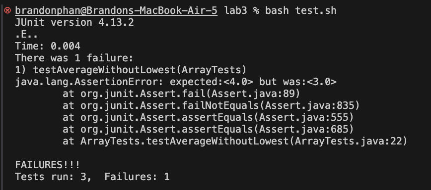
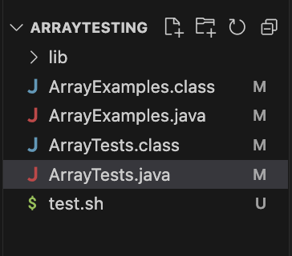

### Part 1 – Debugging Scenario

1. Piazza Post

Summary: Test Fail for ChatServer, Need Help.

Details: I've been working on the ArrayExamples assignment for a while, but I can't seem to figure out why my averageWithoutLowest method is not working. 
When I run the test script, I get the following error message: . 

I've attached a picture of my method below. What am I doing wrong? Is my lowest number searcher code not working somehow? .

---

2. Instructor Response:

Response: Your test seems to be getting 3 as the output for your test while it expects 4. What possible reasons are there for a mean average to be undercounted? The code to find the lowest number looks good! It is something else that needs to be addressed. 


4. Necessary Information

File & Directory Structure: 

Contents of Each File:

ArrayExamples.java:

```public class ArrayExamples {

  // Changes the input array to be in reversed order
  static void reverseInPlace(int[] arr) {
    int[] temp = new int[arr.length];
    for(int i = 0; i < arr.length; i += 1) {
      temp[i] = arr[i];
    }
    for(int i = 0; i < arr.length; i += 1) {
      arr[i] = temp[arr.length - i - 1];
    }
  }

  // Returns a *new* array with all the elements of the input array in reversed
  // order
  static int[] reversed(int[] arr) {
    int[] newArray = new int[arr.length];
    for(int i = 0; i < arr.length; i += 1) {
      newArray[i] = arr[arr.length - i - 1];
    }
    return newArray;
  }

  // Averages the numbers in the array (takes the mean), but leaves out the
  // lowest number when calculating. Returns 0 if there are no elements or just
  // 1 element in the array
  static double averageWithoutLowest(double[] arr) {
    if(arr.length < 2) { return 0.0; }
    double lowest = arr[0];
    for(double num: arr) {
      if(num < lowest) { lowest = num; }
    }
    double sum = 0.0;
    for(double num: arr) {
      sum += num;
    }
    return (sum-lowest) / (arr.length);
  }


}```

ArrayTests.java

```import static org.junit.Assert.*;
import org.junit.*;

public class ArrayTests {
	@Test 
	public void testReverseInPlace() {
    int[] input1 = { 3, 2, 1 };
    ArrayExamples.reverseInPlace(input1);
    assertArrayEquals(new int[]{ 1, 2, 3 }, input1);
	}


  @Test
  public void testReversed() {
    int[] input1 = { 0, 1, 2};
    assertArrayEquals(new int[]{ 2, 1, 0 }, ArrayExamples.reversed(input1));
  }

  @Test
  public void testAverageWithoutLowest() {
    double[] input1 = { 0.0, 1.0, 2.0, 9.0};
    assertEquals(4.0, ArrayExamples.averageWithoutLowest(input1),0.01);
  }
}```

test.sh:

```javac -cp .:lib/hamcrest-core-1.3.jar:lib/junit-4.13.2.jar *.java

java -cp .:lib/hamcrest-core-1.3.jar:lib/junit-4.13.2.jar org.junit.runner.JUnitCore ArrayTests```
