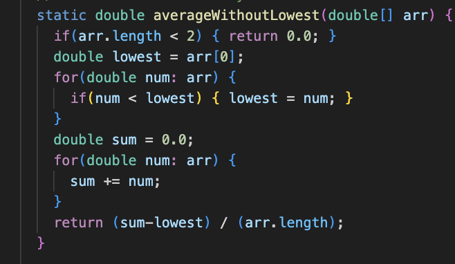

### Part 1 – Debugging Scenario

1. Piazza Post

Summary: Test Fail for ChatServer, Need Help.

Details: I've been working on the ArrayExamples assignment for a while, but I can't seem to figure out why my averageWithoutLowest method is not working. 
When I run the test script, I get the following error message: . 

I've attached a picture of my method below. What am I doing wrong? .

4. Necessesary Information

File & Directory Structure: 
